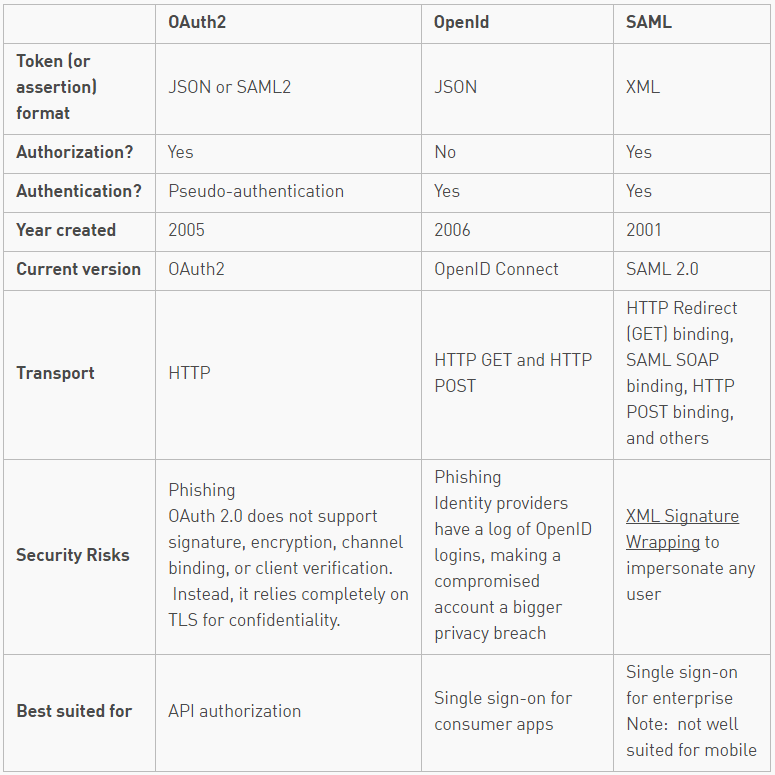

本文转载自[Atomic](https://spin.atomicobject.com/2016/05/30/openid-oauth-saml/)

### Authentication and Authorization: OpenID vs OAuth2 vs SAML

My current project at AO has provided a lot of opportunity to learn about web security and what’s going on when you click that ubiquitous “Sign in with Google/Facebook” button. As both a computer developer and an end user, I want applications that are secure without being too difficult to use.

Looking for an option to fit both our application and our customer’s security policies, we investigated [OpenID](http://openid.net/), [OAuth2](https://oauth.net/2/), and [SAML](https://wiki.oasis-open.org/security/FrontPage).

<!-- more -->

### Authorization & Authentication Basics

Our project, a single-page application, will be a public-facing website. We want to restrict access to registered users only. Furthermore, we want to tailor each user’s experience, and the amount and type of data that they can view, to their individual roles and access levels.

In other words, we want to be able to authenticate and authorize each user. Authentication means verifying that someone is indeed who they claim to be. Authorization means deciding which resources a certain user should be able to access, and what they should be allowed to do with those resources. Oftentimes, as in our case, an application will require a little bit of both.

With sites like Facebook or Google, a user can log in to one application with a set of credentials. This same set of credentials can then be used to log in to related websites or applications (like websites that ask you, “Sign up with Facebook or Google account?”).

Likewise, a business may have an internal-facing employee portal with links to intranet sites regarding timesheets, health insurance, or company news. Rather than requiring an employee to log in at each website, a better solution would be to have the employee log in at a portal, and have that portal automatically authenticate the user with the other intranet sites. This idea, called single sign-on (SSO), allows a user to enter one username and password in order to access multiple applications.

The benefits are pretty nice for the user. The use of linked identities means they have to manage only one username and password for the related websites. The user experience is better for them, as they can avoid multiple logins. A user’s (single set of) credentials will be stored in one database, rather than multiple credentials stored across multiple databases (with, let’s be honest, likely repeated passwords). This also means that developers of the various applications don’t have to store passwords. Instead, they can accept proof of identity or authorization from a trusted source.

There are multiple solutions for implementing SSO. The three most common web security protocols (at the time of this writing) are OpenID, OAuth, and SAML. Implementations and libraries exist in multiple languages already, and going with a standardized protocol allows better interoperability than a custom solution.

### OpenID

OpenID is an open standard for authentication, promoted by the non-profit OpenID Foundation. As of March 2016, there are over a billion OpenID-enabled accounts on the internet, and organizations such as Google, WordPress, Yahoo, and PayPal use OpenId to authenticate users.

A user must obtain an OpenID account through an OpenID identity provider (for example, Google). The user will then use that account to sign into any website (the relying party) that accepts OpenID authentication (think YouTube or another site that accepts a Google account as a login). The OpenID standard provides a framework for the communication that must take place between the identity provider and the relying party.

This exchange can be compared to a border crossing.  Imagine that Alice is a Canadian citizen who wants to visit the US. At the border, the US asks for proof of identity (her passport). Because the US government trusts the Canadian government to accurately provide identification for its citizens, the US accepts Alice’s passport as reliable proof of her identity, and thus, lets her enter the US. In this example, Alice is the end user, the US is the relying party, and Canada is the identity provider.

This exchange works because Alice can provide proof of identity to the US that originates from an entity that the US trusts. Similarly, the relying party (or website that a user is trying to log in to) must trust the OpenID identity provider that will verify the user’s identity.

On a website, the exchange looks like this:

Let’s return to Alice, who wants to log in to her MyBlogger account (the relying party). She navigates to the login screen, where she is offered a “Sign in with Google” option. She clicks that, and MyBlogger initiates association with Google and requests and receives an association handle. MyBlogger then forwards Alice to the Google login page. She enters her credentials, and Google validates them. She is then redirected back to MyBlogger, along with a token stating that Google believes she is who she claims to be (Alice). MyBlogger trusts this token and creates a session for her.

Notes:
- OpenID is technically a URL that a user owns (e.g. alice2016.openid.com), so some websites offer the option to manually enter an OpenID.
- The latest version of OpenID is OpenID Connect, which combines OpenID authentication and OAuth2 authorization.
-  
- Facebook previously used OpenID but has since moved to Facebook Connect.

### OAuth2

By contrast, OAuth2 is an open standard for authorization. Confusingly, OAuth2 is also the basis for OpenID Connect, which provides OpenID (authentication) on top of OAuth2 (authorization) for a more complete security solution. OpenID Connect (OIDC) was created in early 2014. This primer will instead focus on OAuth2 by itself, not as a part of OIDC.

OAuth2 provides secure delegated access, meaning that an application, called a client, can take actions or access resources on a resource server on the behalf of a user, without the user sharing their credentials with the application. OAuth2 does this by allowing tokens to be issued by an identity provider to these third-party applications, with the approval of the user. The client then uses the token to access the resource server on behalf of the user.

Yet Twitter’s [OAuth guide](https://dev.twitter.com/oauth/overview/faq) says that OAuth2 is an authentication standard. So what gives? As it turns out, authorization can be used as a form of pseudo-authentication.

An authorization use case of OAuth2 might be as follows: Alice is leaving town and she wants her friend Bob to house-sit. Alice gives Bob the house key, and he now has access to enter the house. The key gives him authorization to enter the house, as authorization relates to which resources a user should have access to, and what they can do with those resources. In this metaphor, the homeowner is the user, Bob is the client, the door lock is the identity provider, and the house is the resource server.

This can be twisted into a pseudo-authentication use case by assuming that the person who has the house key is the homeowner. However, as we can see with Bob house-sitting for Alice, this is not always the case.

Online, an OAuth2 use case might look like this:  Alice signs up for a new account at NewApp and is offered the option to see which of her friends already use NewApp so she can connect with them. There’s a button labeled “import contacts from Facebook.” Alice clicks that button, and she is redirected to Facebook to log in. Alice successfully logs in and is asked if she wants to share her Facebook friend list with NewApp. She clicks yes, and is forwarded back to NewApp along with a token. NewApp now has permission (with the token) to access Alice’s friend list, without her sharing her credentials directly with NewApp. This eliminates the risk of NewApp logging into Facebook on Alice’s behalf and doing things she wouldn’t want (posting status updates, changing her password, etc.).

### SAML

SAML is the oldest standard of the three, originally developed in 2001, with its most recent major update in 2005. SAML, pronounced “sam-el,” stands for Security Assertion Markup Language. It’s an open standard that provides both authentication and authorization.

Similar to the terminology of the other two standards, SAML defines a principal, which is the end user trying to access a resource. There is a service provider, which is the web server that the principal is trying to access. And there is an identity provider, which is the server that holds the principal’s identities and credentials.

The US/Canada metaphor can be used here, as well. Alice wishes to enter the US from Canada. The US, wishing to verify her identity or other information about her–perhaps whether she has a valid driver’s license that will allow her to drive in the US)–makes a request to Canada for authentication and/or authorization information regarding Alice. Canada responds by sending the requested information to the requested address, along with some proof that Canada was indeed the sender of the message. All metaphors break down eventually, but this proof might take the form of a passport, as before, or official government documents or visas (where authorization requests are involved). And, as before, the system is predicated on US trust that Canada is issuing driver’s licenses, visas, etc. properly.

In our example, Alice is the principal, the US is the service provider, and Canada is once again the identity provider. The request made to Canada by the US is analogous to an XML message that states what information is being requested, who is asking, and to whom the response should be returned. Canada’s response would be called an assertion, in SAML terms (similar to a token for OpenID or OAuth2). This assertion can contain statements about authentication, authorization, and/or attributes (specific information about a user, such as email or phone number).

The SAML 2.0 specification defines assertions (as discussed above); protocols, which are assertion requests and responses; bindings, or how these requests and responses happen between the service provider and identity provider, using standard communication methods (e.g. HTTP POST); and profiles, which are combinations of assertions, protocols and bindings for various use cases, like SSO.

An SSO use case might look like this: Alice is a manager at Acme Corp. She accesses Acme Corp’s intranet portal, where she logs in with her credentials. After logging in, she can click on a number of links that may be of interest to her (payroll, company news, Salesforce, etc.). She clicks on the Salesforce link, which contains a SAML assertion about Alice. She is forwarded to Salesforce, which receives the SAML assertion. Salesforce trusts Acme Corp, and thus trusts the assertion. Using information in the token, Alice is automatically logged in, and the appropriate data is shown to her based on attributes in the assertion.

### Summary

These three options are summarized in the table.

